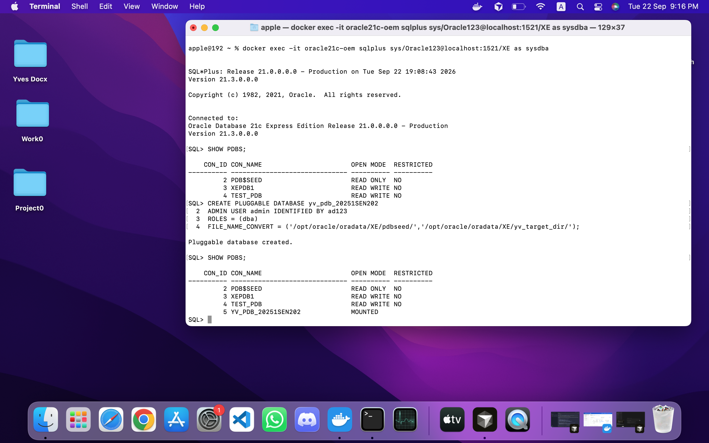
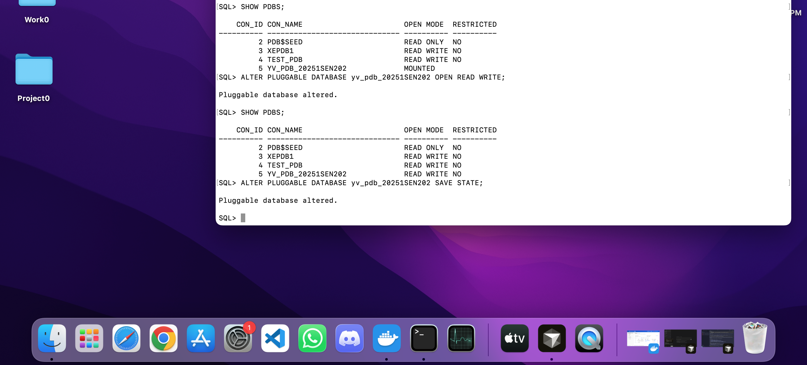
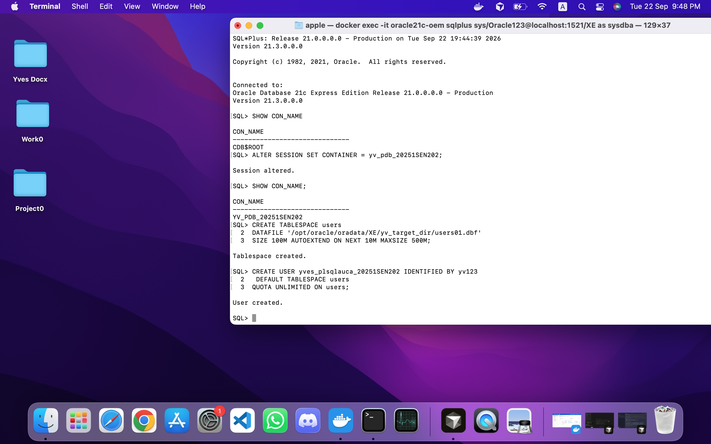
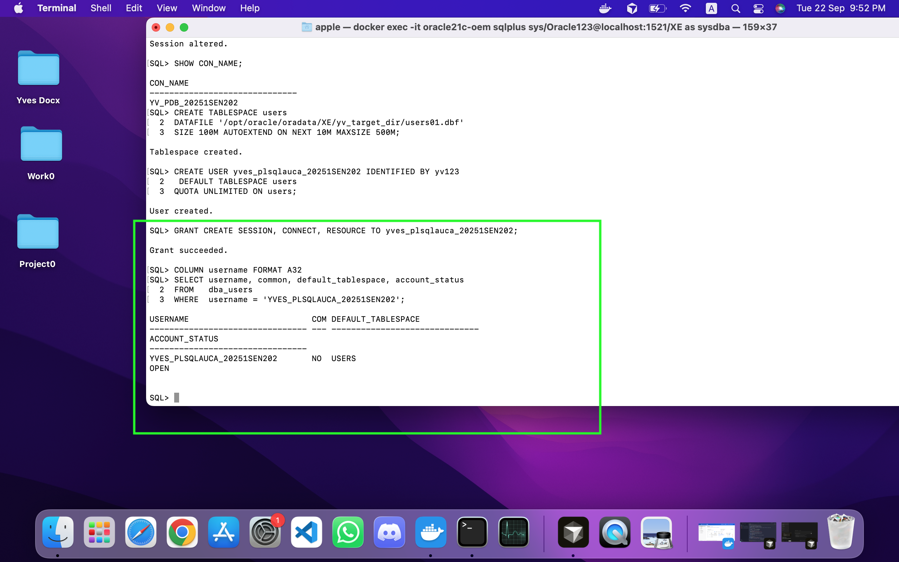
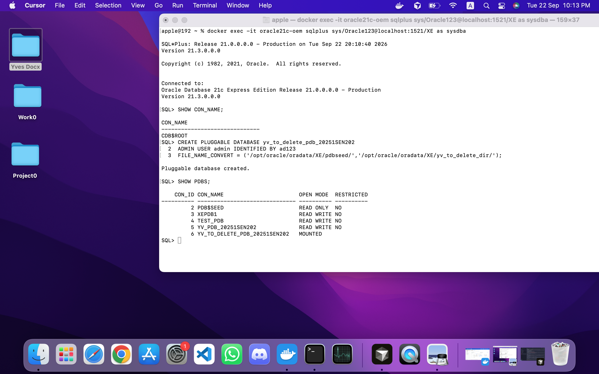
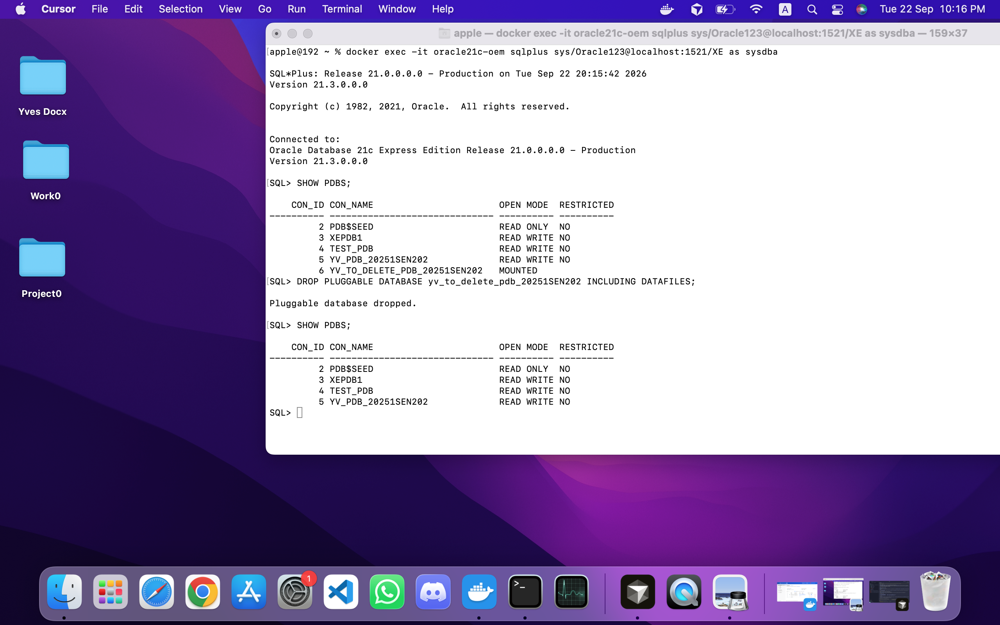
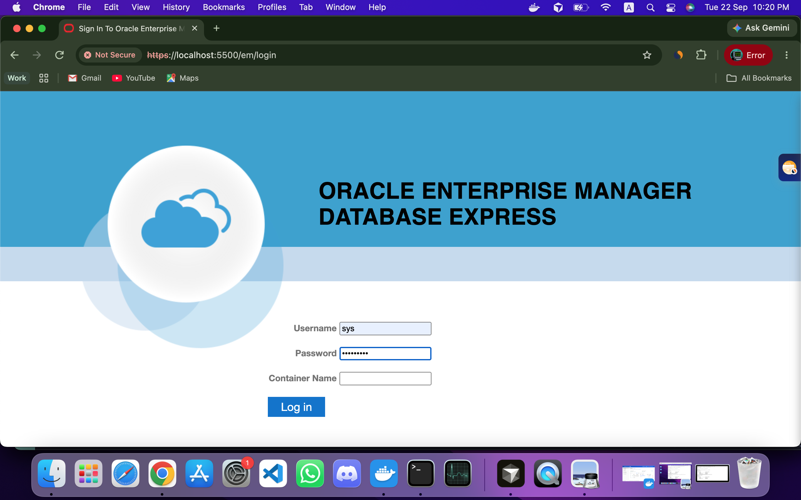
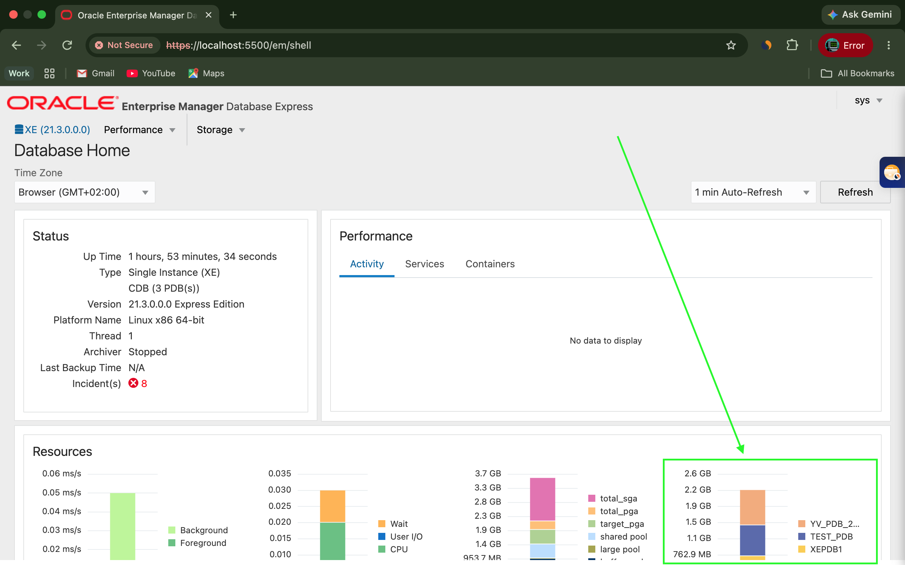

# Oracle Pluggable Databases (PDB) Management – Individual Assignment II

| Field | Details |
|---|---|
| **Student Name** | MUGISHA Yves |
| **Student ID** | 20251SEN202 |
| **Course** | Database Development with PL/SQL (INSY 8311) |
| **Instructor** | Eric Maniraguha |
| **Teaching Assistant** | Afanyu Emmanuel |
| **Assignment Date** | September 17, 2026 |
| **Deadline** | Monday, September 22, 2026, 11:59 PM |

---

## Overview of Tasks

This assignment covers Oracle's multitenant architecture in practice. A container database
(CDB) holds the root container, a read-only seed, and one or more pluggable databases (PDBs).
I created a PDB from the seed and a local user inside it, created a second PDB purely to
delete it so as to demonstrate the full lifecycle, viewed the resulting environment through
Oracle Enterprise Manager Express, and documented the work in this repository.

| # | Task | Object Name |
|---|---|---|
| 1 | Create a new Pluggable Database and a user inside it | PDB: `yv_pdb_20251SEN202` · User: `yves_plsqlauca_20251SEN202` |
| 2 | Create and delete a temporary PDB | `yv_to_delete_pdb_20251SEN202` |
| 3 | Oracle Enterprise Manager (OEM) dashboard | — |
| 4 | Documentation & reporting on GitHub | This repository |

---

## Oracle Environment Used

- **Oracle Database version:** Oracle Database 21c Express Edition, 21.3.0.0.0
- **Deployment:** Oracle's official container image
  `container-registry.oracle.com/database/express:21.3.0-xe`, running in Docker on macOS
- **CDB / SID:** `XE`, single instance, platform reported as Linux x86 64-bit
- **Ports:** listener published on host port 1522 (1521 inside the container),
  EM Express on 5500
- **Client tools:** SQL*Plus, run inside the container via `docker exec`
- **Enterprise Manager:** EM Express at `https://localhost:5500/em`
- **Datafile location:** `/opt/oracle/oradata/XE/` inside the container

---

## Task 1 – Create a New Pluggable Database

- **PDB name:** `yv_pdb_20251SEN202`
- **User created inside the PDB:** `yves_plsqlauca_20251SEN202`

I connected as `SYS AS SYSDBA` and confirmed with `SHOW CON_NAME` that I was in `CDB$ROOT`,
since a PDB can only be created from the root container.

A new PDB is a physical copy of `PDB$SEED`, so Oracle needs to know where to put the copied
datafiles. I checked `db_create_file_dest` and found it empty, meaning Oracle Managed Files
was not enabled and I had to supply the paths myself. I listed the seed's datafiles from
`v$datafile` to find its directory, then used `FILE_NAME_CONVERT` to map that directory onto
a new one for my PDB. The `ADMIN USER` clause created an administrative account inside the
PDB, and `ROLES = (dba)` gave that account real privileges — without it the `PDB_DBA` role
it receives is empty and the user cannot do anything.

A newly created PDB is in MOUNTED state, which means it exists but no data is accessible and
nobody can connect, so I opened it `READ WRITE`. I then ran `SAVE STATE`, because the default
is `DISCARD STATE`: without it the PDB reverts to MOUNTED whenever the CDB restarts, which
matters here since the database runs in a container I stop and start.

To create the user I first switched into the PDB with `ALTER SESSION SET CONTAINER`. This step
is required, not optional: `yves_plsqlauca_20251SEN202` is a *local* user, and local users can
only be created inside their PDB. Attempting it from the root fails with ORA-65096, because
a user created in the root is a common user and must be named with a `C##` prefix.

Creating the user needed a tablespace to put its objects in, which is covered under Challenges
below. I then granted `CREATE SESSION`, `CONNECT` and `RESOURCE` — `CREATE SESSION` is the
privilege to log in at all, and `RESOURCE` allows creating tables and other objects. I verified
the result in `DBA_USERS`, where `COMMON = NO` confirms the user is local to the PDB, and
finally logged in as that user in a separate session. The login test is the strongest evidence,
because it proves the whole chain at once: the PDB is open, registered as a service, the
password works, and the privileges are sufficient.

### Evidence

**PDB creation command**



**PDB open state**



**User created inside the PDB**



**Privileges granted to the user**



**Login verification**


---

## Task 2 – Create and Delete a PDB

- **Temporary PDB name:** `yv_to_delete_pdb_20251SEN202`

The purpose of this task is to demonstrate the full lifecycle of a pluggable database. A PDB
is not a permanent fixture — being able to provision one and remove it cleanly is the core
operational skill of the multitenant architecture, and it underlies cloning, testing, and
moving databases between CDBs.

I created `yv_to_delete_pdb_20251SEN202` from the root using the same approach as Task 1, with
its own target directory so its datafiles stayed separate from my main PDB's. I verified it
existed with `SHOW PDBS`, where it appeared in MOUNTED state. I did not open it, since nothing
in this task required using it.

Before dropping it I closed it with `CLOSE IMMEDIATE`. This is required: `DROP PLUGGABLE
DATABASE ... INCLUDING DATAFILES` needs the PDB to be mounted or unplugged, because Oracle
will not delete files that are open and possibly being written to. Dropping an open PDB fails
with ORA-65025.

I then dropped it with `INCLUDING DATAFILES`. The default is `KEEP DATAFILES`, which exists
because the usual reason to drop a PDB is to move it to another CDB, where the files must
survive to be plugged in again. This assignment required the PDB to be genuinely removed, so
I overrode that default. The operation cannot be rolled back. I confirmed the result with
`SHOW PDBS`, which no longer listed the PDB, and the datafile directory was gone from disk.

### Evidence

**Temporary PDB created and verified**



**Temporary PDB deleted and confirmed**



---

## Task 3 – Oracle Enterprise Manager (OEM)

EM Express is a web console built into the database itself, served by Oracle XML DB over HTTPS
on a port stored in the database rather than by any separate application server. I confirmed
the port with `SELECT DBMS_XDB_CONFIG.getHttpsPort() FROM dual;`, which returned 5500, and
opened `https://localhost:5500/em`. The browser warns about the certificate because it is
self-signed for localhost, which is expected for a local instance.

I logged in as `SYS` with the SYSDBA role. The console requires an account with DBA privilege,
so my course user `yves_plsqlauca_20251SEN202` could not be used — it holds only `CONNECT`,
`RESOURCE` and `CREATE SESSION`. Leaving the container field blank connects to the CDB root,
which is the view that shows the whole environment rather than a single PDB.

The dashboard reports the instance as Up, version 21.3.0.0.0 Express Edition, Single Instance
(XE) on Linux x86 64-bit, and identifies it as a CDB with its pluggable databases counted in
the header — reflecting the PDB work completed in Tasks 1 and 2. The logged-in user is shown
in the console. The Containers tab presents per-container activity, which showed no data
because the PDBs were open but idle at the time.

It is worth noting that EM Express is deprecated as of Oracle Database 21c and has been removed
in 23ai, so this tooling is specific to this release.

### Evidence

**EM Express login**



**EM Express dashboard**



---

## Challenges Faced and Solutions

### 1. EM Express not available on the first Docker image

My first attempt used a community-built Oracle XE image, and EM Express could not be
reached at all. These images are trimmed down for size and do not configure the XML DB
HTTPS endpoint, so there was no console listening no matter which ports I published.
I switched to Oracle's official image, `container-registry.oracle.com/database/express:21.3.0-xe`,
which configures EM Express during database creation. I confirmed the port with
`SELECT DBMS_XDB_CONFIG.getHttpsPort() FROM dual;` (returned 5500) and then reached the
console at `https://localhost:5500/em`.

### 2. Datafiles created as a filename prefix instead of a directory

On my first PDB the `FILE_NAME_CONVERT` target path had no trailing slash. Because the
clause performs a plain string substitution rather than choosing a directory, the datafiles
were created as `/opt/oracle/oradata/XE/<prefix>system01.dbf` — loose in the parent folder
with the name glued on as a prefix. I found this by querying `v$datafile` for the new
container. Adding the trailing slash to the target produced a proper directory for the PDB.

### 3. ORA-00959: tablespace 'USERS' does not exist

Creating my user failed with `ORA-00959`. A PDB created from `PDB$SEED` ships only with
SYSTEM, SYSAUX, UNDOTBS1 and TEMP — there is no `USERS` tablespace, unlike the default
`XEPDB1`. I confirmed this with `DBA_TABLESPACES` in both containers, then created a
`USERS` tablespace in my PDB and re-ran `CREATE USER` with it as the default tablespace.

### 4. git push failing with HTTP 400

Pushing the screenshots failed with `error: RPC failed; HTTP 400`. The screenshots totalled
about 17 MB, which exceeds Git's default 1 MB `http.postBuffer` for a single push over HTTPS.
Raising it with `git config http.postBuffer 524288000` allowed the push to complete.

---

## Integrity Statement

I, MUGISHA Yves (Student ID: 20251SEN202), confirm that this assignment was completed individually.
All commands were written and executed by me, and all screenshots come from my own environment.
I did not copy from classmates or use AI tools to generate commands or solutions.

---

## Submission Details

```
Repository Link: https://github.com/Yves-Developer/oracle_pdb_ass_II_20251SEN202_yves
PDB Name Created: yv_pdb_20251SEN202
Issues Encountered: Yes
```
